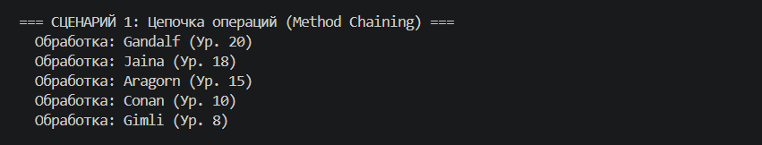
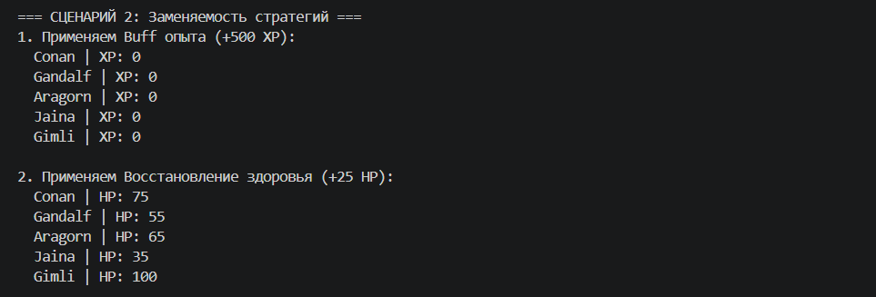
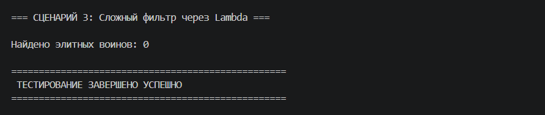
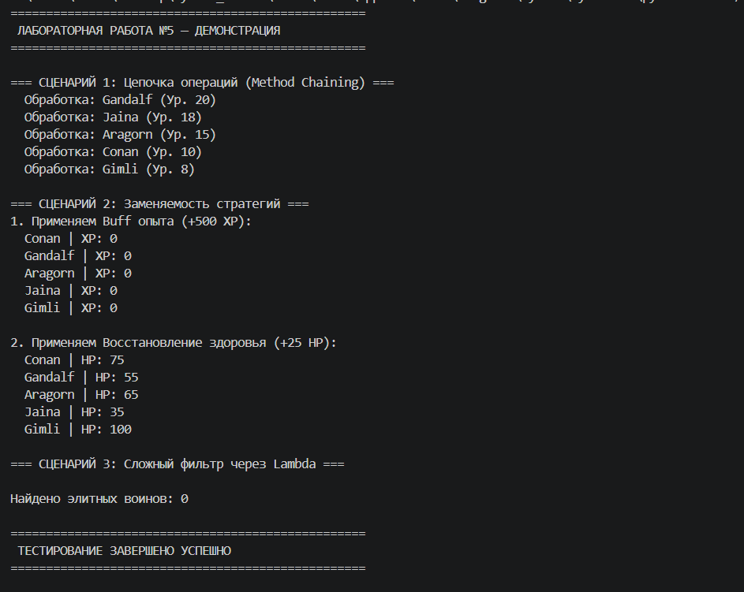

# Лабораторная работа №5: Функции как аргументы. Стратегии и делегаты.

## 1. Цель работы
Изучение функциональных возможностей языка Python, таких как функции высшего порядка (`map`, `filter`), использование функций в качестве аргументов, работа с `lambda`-выражениями, а также реализация архитектурного паттерна «Стратегия» с помощью `callable`-объектов и цепочек вызовов (Method Chaining).

---

## 2. Реализованные функции и стратегии

### Функции-стратегии и фильтры:
*   **`is_alive` / `is_warrior`**: Функции-предикаты, используемые в качестве аргументов для фильтрации коллекции.
*   **`by_level`**: Функция-ключ для реализации гибкой сортировки объектов.
*   **`lambda`-выражения**: Применены в `demo.py` для быстрых операций трансформации и кастомной фильтрации (например, фильтрация по нескольким условиям).

### Функции высшего порядка и фабрики:
*   **`filter_by` / `sort_by`**: Методы коллекции, которые принимают функции как аргументы, делегируя им логику обработки данных.
*   **`apply`**: Функция высшего порядка, которая применяет переданный алгоритм (функцию или `callable`-объект) ко всем элементам коллекции.

### Паттерн Стратегия и Callable-объекты (Задание на 5):
Реализованы классы-стратегии **`ExperienceBuff`** и **`HealthRestore`**. Благодаря магическому методу `__call__`, эти объекты ведут себя как функции, сохраняя при этом внутреннее состояние (например, величину бонуса). Это позволяет динамически менять поведение коллекции методом `apply()`.

---

## 3. Демонстрация работы
Сценарии в `demo.py` демонстрируют возможности функционального программирования:

1.  **Сценарий №1 (Method Chaining):** Последовательное выполнение операций `filter -> sort -> apply`. Продемонстрирована цепочка вызовов, где каждый метод возвращает объект коллекции.

2.  **Сценарий №2 (Заменяемость стратегий):** Демонстрация паттерна Стратегия. К одной и той же коллекции поочередно применяются разные `callable`-объекты (бафф опыта и восстановление здоровья).

3.  **Сценарий №3 (Сложная фильтрация):** Использование `lambda` для фильтрации объектов по комбинированным условиям (класс + уровень здоровья).

**Скриншоты вывода:**

---

## 4. Вывод
В ходе выполнения работы были изучены:
*   **Передача функций как аргументов:** Понимание того, что функции в Python являются объектами первого класса.
*   **Lambda, map, filter:** Использование встроенных инструментов для лаконичной обработки последовательностей.
*   **Замыкания и функции высшего порядка:** Реализация методов, расширяющих функционал контейнера без изменения его базового кода.
*   **Паттерн Стратегия:** Создание гибкой архитектуры, где алгоритмы (лечение, прокачка) отделены от самих объектов и могут легко заменяться.
