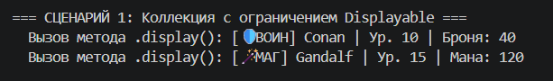
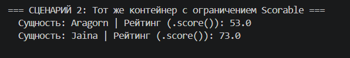
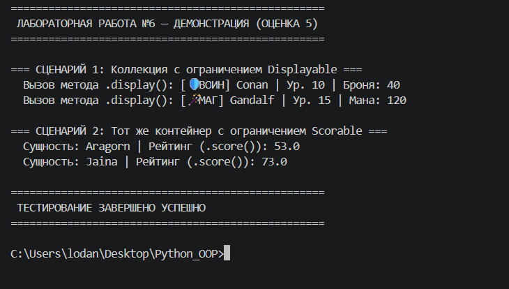

# Лабораторная работа №6: Аннотации типов, Generics и Протоколы

## 1. Цель работы
Освоение продвинутой системы статической и структурной типизации в Python (модуль `typing`). Изучение концепции обобщенного программирования с использованием параметров типов (`TypeVar`, `Generic`), а также практическое применение интерфейсов-протоколов (`typing.Protocol`) для реализации строгого Duck Typing на этапе разработки.

---

## 2. Описание реализованных типов и контейнеров

### Реализованные Generic-классы:
*   **`TypedCollection(Generic[T])`**: Обобщенный кастомный контейнер, который полностью повторяет интерфейс коллекции из ЛР-2, но теперь строго отслеживает тип хранящихся внутри элементов (`T`). Это обеспечивает подсказки в IDE и безопасность типов (Type Safety) без жесткой привязки к конкретным классам.

### Использованные переменные типа (TypeVar) и ограничения:
*   **`T = TypeVar('T')`**: Базовый универсальный параметр типа для элементов коллекции.
*   **`R = TypeVar('R')`**: Параметр типа результата для метода `map()`, позволяющий отслеживать изменение типов при трансформации (например, перевод объекта в строку или число).
*   **`D = TypeVar('D', bound=Displayable)`**: Параметр типа, ограниченный протоколом `Displayable`. Гарантирует, что коллекция примет только объекты с методом вывода карточки.
*   **`S = TypeVar('S', bound=Scorable)`**: Параметр типа, ограниченный протоколом `Scorable`. Гарантирует, что коллекция примет только объекты с методом расчета игрового рейтинга.

### Описание протоколов и соответствующих классов (Задание на 5):
*   **Протокол `Displayable`**: Описывает контракт для объектов, умеющих возвращать свое строковое описание через метод `display() -> str`.
*   **Протокол `Scorable`**: Описывает контракт для объектов, умеющих рассчитывать числовую боевую эффективность через метод `score() -> float`.
*   **Соответствующие классы**: Классы `Warrior` (Воин) и `Mage` (Маг) реализуют эти методы. Они **не наследуются** от протоколов явно, но соответствуют им структурно, что позволяет добавлять их в специализированные контейнеры.

---

## 3. Демонстрация работы
Сценарии в файле `demo.py` наглядно демонстрируют работу структурного полиморфизма:

1.  **Сценарий №1 (Протокол Displayable):** Создание коллекции `TypedCollection[Displayable]` и добавление объектов разных классов (`Warrior` и `Mage`). Демонстрируется успешный вызов метода `.display()` для каждого элемента без проверки их явного типа (if/isinstance).

2.  **Сценарий №2 (Протокол Scorable):** Использование того же базового класса коллекции, но с параметризацией `TypedCollection[Scorable]`. Демонстрируется универсальность контейнера и корректный сбор числового рейтинга через метод `.score()`.

**Скриншоты вывода:**

---

## 4. Вывод
В ходе выполнения лабораторной работы были изучены:
*   **Аннотации типов и их роль:** Понимание того, как явное указание типов защищает код от runtime-ошибок (таких как `AttributeError`) и заменяет устаревшую документацию.
*   **Generic и TypeVar:** Освоение принципа создания повторно используемых абстрактных компонентов (контейнеров), которые адаптируются под любой переданный тип данных.
*   **Protocol как структурный интерфейс:** Понимание разницы между номинальной (ABC) и структурной типизацией (Protocol). Протоколы позволяют связывать контрактом объекты из абсолютно разных ветвей наследования.
*   **Польза типизации для поддержки кода:** Строгая типизация делает проект масштабируемым. Среда разработки (IDE) сразу указывает на ошибки несовместимости типов до запуска программы, что критически важно в больших коммерческих проектах.
